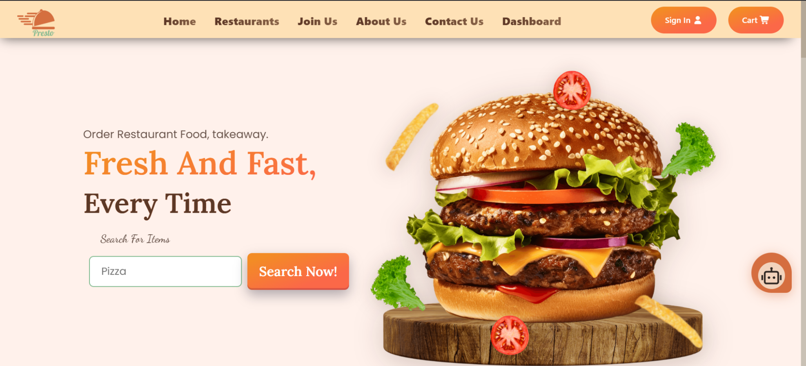
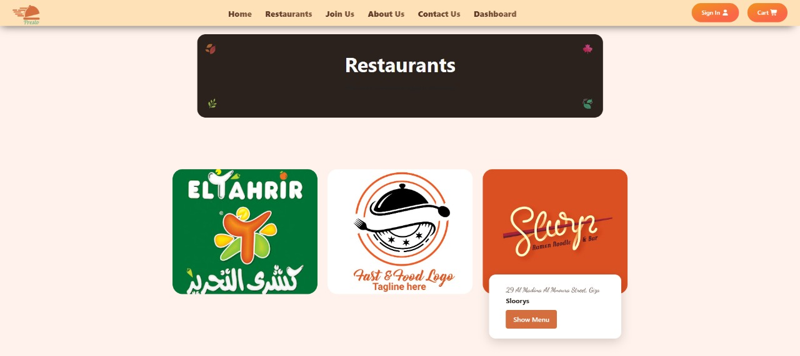
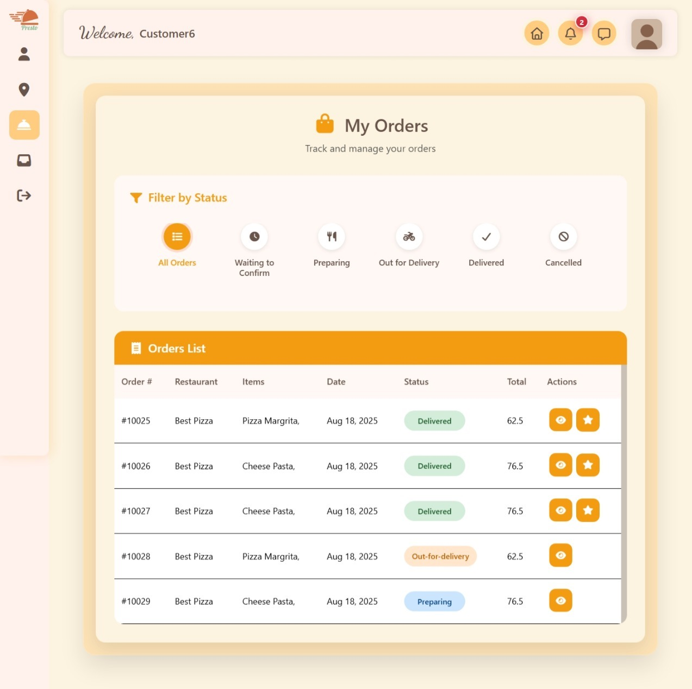
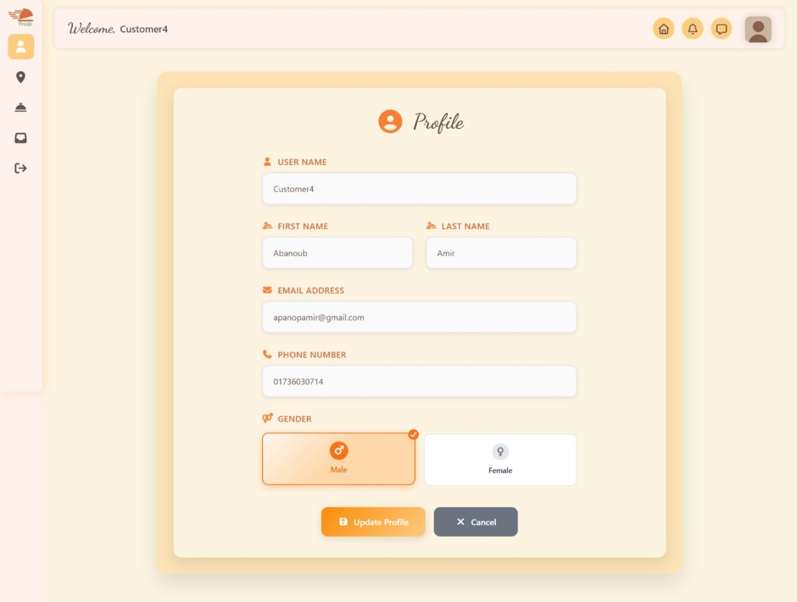

# 🍽️ Presto – Smart Food Delivery Platform

Welcome to **Presto** — a powerful, scalable, and AI-powered **food delivery platform** built with modern technologies and clean architecture principles.  
It’s fast ⚡, smart 🧠, and designed for real-world production environments 🍕.

🔗 **Live Demo:**  
👉 [https://tourmaline-marzipan-6a3d17.netlify.app/home](https://tourmaline-marzipan-6a3d17.netlify.app/home)

---

## 🧠 Application Overview

**Presto** is a comprehensive food delivery application developed with:  
- **.NET Core Web API**  
- **.NET MVC**  
- **Angular**

It supports multiple user roles — **Admin, Restaurant, Customer, and DeliveryMan** — with **real-time communication**, **AI-powered assistance**, and **secure payment integration**.

---

## 🧩 Architecture & Design Patterns

🧱 **Dependency Injection Pattern:**  
Interfaces for both repositories and services ensure adherence to **SOLID principles** (Interface Segregation & Dependency Inversion).  

⚙️ **Service Layer Pattern:**  
Clear separation between business logic and data access for maintainability.  

🗂️ **Repository Pattern:**  
Abstract data access with interfaces like `ICustomerRepo`, `IOrderRepo`, etc.

---

## 💪 Key Features & Strengths

### 🔐 1. Robust Authentication & Authorization
- ASP.NET Core Identity Integration  
- JWT Token-based Authentication  
- Role-based Access Control (Admin, Restaurant, Customer, DeliveryMan)  
- Email Confirmation & Password Reset  

---

### 💬 2. Real-time Communication
- Live chat functionality with **SignalR**  
- Real-time order status updates 📦  
- Instant notifications 🔔  

---

### 📍 3. Advanced Geospatial Features
- Integrated **NetTopologySuite** for location-based services  
- **OpenRouteService** for delivery route optimization 🚴‍♂️  
- Smart delivery assignment using distance calculations  

---

### 🤖 4. AI-Powered Features
- **Gemini AI** integration for embeddings and intelligent chat  
- Knowledge base with **RAG (Retrieval-Augmented Generation)**  
- AI-driven customer support assistant 💬  

---

### 💳 5. Secure Payment System
- **Stripe** payment integration  
- Secure checkout with session management  
- Payment link generation and validation  

---

### 🏪 6. Comprehensive Business Logic
- Multi-restaurant support 🍔  
- Shopping cart management with restaurant validation  
- Full order lifecycle management  
- Delivery man assignment algorithm  
- Promo code & discount system 🎁  
- Reviews & ratings  

---

### 🖼️ 7. File & Media Management
- Image upload and processing for restaurants & menu items  
- Secure storage with validation  

---

### 📧 8. Email Services
- SMTP-based automated email notifications  
- Beautiful HTML templates for confirmations and alerts  

---

### 🧭 9. Frontend Integration
- Angular frontend using a singleton component architecture  
- .NET MVC admin dashboard for management tasks  

---

### 🗃️ 10. Data Management
- **Entity Framework Core** with SQL Server  
- **AutoMapper** for clean object mapping  
- **Transactional operations** for consistency  

---

### 🧰 11. Additional Technical Highlights
- Comprehensive error handling and input validation  
- Logging & debugging capabilities 🪵  
- Config-based settings management  
- Environment-specific configuration profiles  

---

### 🚀 12. Potential Future Enhancements
- Implement **Redis caching** for performance  
- Add **API versioning**  
- Introduce **rate limiting**  
- Full **Swagger API documentation**  
- Explore **CQRS pattern** for complex workflows  

---

## 🧾 Summary

**Presto** demonstrates **enterprise-level architecture**, solid engineering principles, and a strong focus on **performance, scalability, and maintainability**.  
It’s a modern foundation for any production-grade food delivery system.

---

## 🖼️ Project Screenshots

> Add your project screenshots here to showcase UI and features 🎨

| Page | Preview |
|------|----------|
| 🏠 Home |  |
| 🍔 Restaurants |  |
| 📦 Order  |  |
| ⚙️ Customer Dashboard |  |

---

## ⚙️ How to Run Locally

```bash
# Clone the repository
git clone https://github.com/your-username/presto.git

# Navigate to project directory
cd presto

# Install dependencies
npm install

# Start the frontend (Angular)
npm run start

# Run the backend (API)
dotnet run
```
## 🌐 Open in your browser:

Frontend: http://localhost:4200

API: http://localhost:5000 
---
## ✨ Notes
This project is under continuous improvement 🛠️

Stay tuned for future updates including API documentation, caching, and performance enhancements.

Made with ❤️ using .NET, Angular & modern software design principles.
